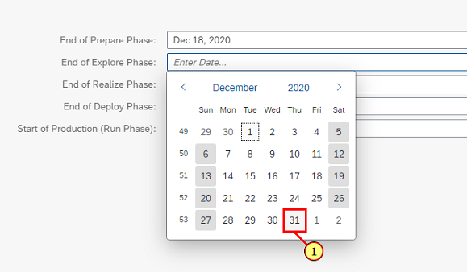

[Back](/README.md)

## Chapter 1 \- Create Project

In this Chapter you create a Project , assign dates for Phases and assign yourself as Project lead and Business process Expert. You can think of Project as a container that holds your Project scope, Requirements , Test cases etc.

### Step 1: Launch SAP Cloud ALM

\(1\) Enter URL https://alm.cloud.sap

### Step 2: Logon

\(1\) Enter tenant as teched\-calm\-xx where xx is your user name.

### Step 3: Logon

\(1\) Enter your specific User Name in the  **User Name**  text field. The format is teched\-buildxx where xx is your username.

### Step 4: Logon

\(1\) Enter your specific password the  **Password**  text field. it is Teched\-buildxx where xx is your user name.

### Step 5: Logon

\(1\) Click  **Log On** .

### Step 6: Overview

\(1\) Click  **Overview** .

### Step 7: Access Help Documentation

\(1\) Click   to open the Help documentation

 

### Step 8: Close Help Documentation

\(1\) Click   to close the Help documentation.

### Step 9: Proceed to Setup

\(1\) Click  **Setup** .

### Step 10: Edit Project

\(1\) Click  **Edit** .

### Step 11: Enter Project details

\(1\) Enter  **S4HANA Cloud &#64; Acron Heating Inc. \(A/B\) xx**  in the  **Project**  text field. Select your group A or B and replace xx with your user number.

### Step 12: Enter Project details

\(1\) Click  .

### Step 13: Enter Project details

\(1\) Click  **SAP S/4HANA Cloud** .

### Step 14: Enter Project details

\(1\) Click  .

### Step 15: Select dates

\(1\) Select a date for End of Prepare phase.

### Step 16: Select dates

\(1\) Click  .

### Step 17: Select dates

\(1\) Select another date for end of Explore phase.

### Step 18: Save the Project

\(1\) Click  **Save** .

### Step 19: Navigate to Teams Tab

\(1\) Click  **Team** .

### Step 20: Edit team details

\(1\) Click  **Edit** .

### Step 21: Edit team details

\(1\) Enter teched\-build xx in the  **Project Lead**  text field where xx is your user name.

### Step 22: Edit team details

\(1\) Click  **teched\-build xx.** 

### Step 23: Edit team details

\(1\) Enter teched\-build xx against  **Business Process Expert** where xx is your user name. Your upcoming tasks depend on your role assignment so make sure you perform this step. Before leaving the team screen make sure you assign yourself both as Project lead and Business Process Expert

 

### Step 24: Edit team details

\(1\) Click  **Save** .

### Step 25: Navigate back

\(1\) Click   to go back to Overview. 

 

You have completed this Chapter.

