## Chapter 2 \- Create Scope

### Step 1: Home - Google Chrome

\(1\) Click to navigate to  **Overview.** 

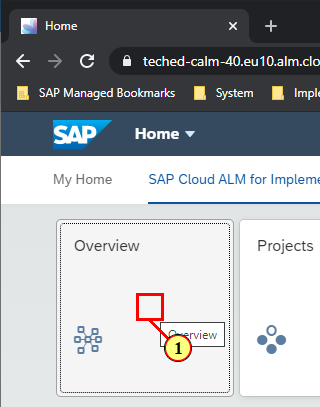

### Step 2: Overview - Google Chrome

\(1\) Click  .

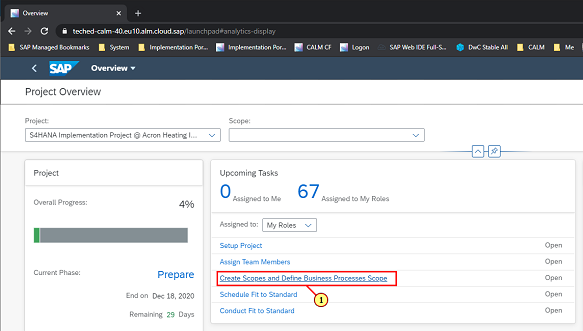

### Step 3: Tasks - Google Chrome

\(1\) Click   to forward navigate to desired application.

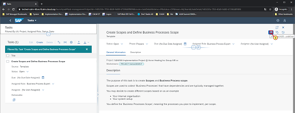

### Step 4: Processes - Google Chrome

\(1\) Click  **Edit** .

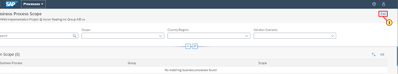

### Step 5: Processes - Google Chrome

\(1\) Click  **Manage Scopes** .

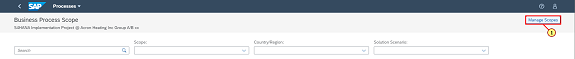

### Step 6: Processes - Google Chrome

\(1\) Click  **Add** .

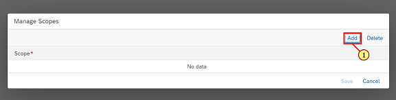

### Step 7: Processes - Google Chrome

\(1\) Enter  **Sales and Customer Returns A/B xx**  in the  **Scope**  text field.

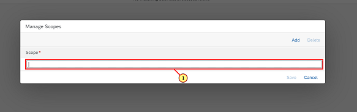

### Step 8: Processes - Google Chrome

\(1\) Click  **Save** .

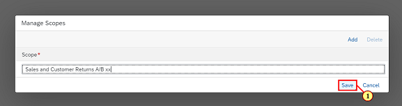

### Step 9: Processes - Google Chrome

\(1\) Click   to select the appropriate content package which is S4 HANA Cloud in this case 

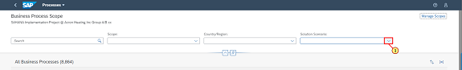

### Step 10: Processes - Google Chrome

\(1\) Click  .

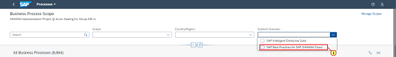

### Step 11: Processes - Google Chrome

\(1\) Click  .

### Step 12: Processes - Google Chrome

\(1\) Click   to get country specific content for Fit to Standard workshops.

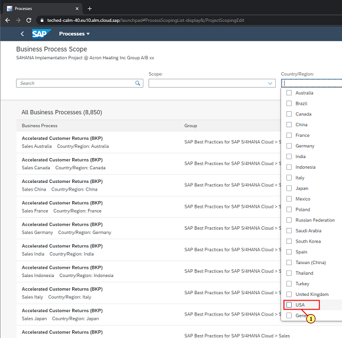

### Step 13: Processes - Google Chrome

\(1\) Click   to put the desired process\(BKP\) in scope.

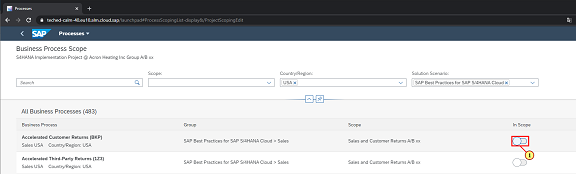

### Step 14: Processes - Google Chrome

\(1\) Click  to add another process  **1Z3** in scope.

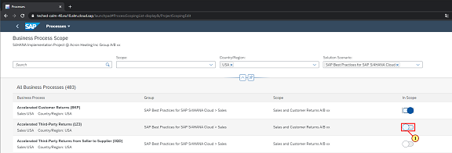

### Step 15: Processes - Google Chrome

\(1\) Click  **Done to**  save the scope. You have completed the Chapter.

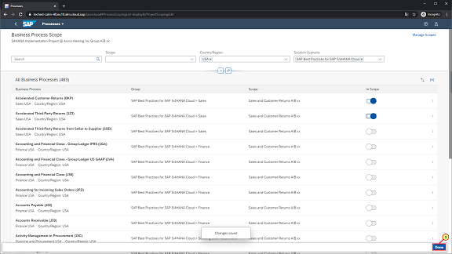

