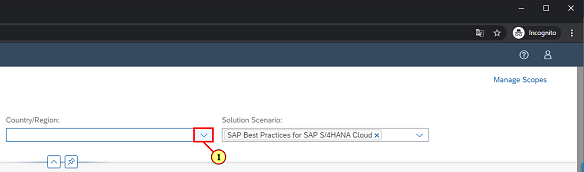

[Back](/README.md)

## Chapter 2 \- Create Scope
In this Chapter zou will create a Scope. Scope is a collection of processes that you want to manage together

### Step 1: Overview

\(1\) Click to navigate to  **Overview.** 

### Step 2: Look at Upcoming tasks

\(1\) Click  .

### Step 3: Read the task details , navigate forward

\(1\) Click   to forward navigate to desired application.

### Step 4: Create Scope

\(1\) Click  **Edit** .

### Step 5: Create Scope

\(1\) Click  **Manage Scopes** .

### Step 6: Create Scope

\(1\) Click  **Add** .

### Step 7: Create Scope

\(1\) Enter  **Sales and Customer Returns A/B xx**  in the  **Scope**  text field.

### Step 8: Create Scope

\(1\) Click  **Save** .

### Step 9: Select Processes

\(1\) Click   to select the appropriate content package which is S4 HANA Cloud in this case 

### Step 10: Select Processes

\(1\) Click  .

### Step 11: Select Processes

\(1\) Click  .

### Step 12: Select Processes

\(1\) Click   to get country specific content for Fit to Standard workshops.

### Step 13: Select Processes

\(1\) Click   to put the desired process\(BKP\) in scope.

### Step 14: Select Processes

\(1\) Click  to add another process  **1Z3** in scope.

### Step 15: Select Processes

\(1\) Click  **Done** to save the scope. You have completed the Chapter.

