[Back](/README.md)

## Chapter 3 \- Create Requirement
SAP Cloud ALM helps you manage your Fit to standard workshops. You can review the process content in these workshops and not down any gaps or Requirements in tool itself. This way you can centralize information and avoid offline Excel sheets.

### Step 1: Select a Process

\(1\) Click  **Accelerated Customer Returns \(BKP\)** .

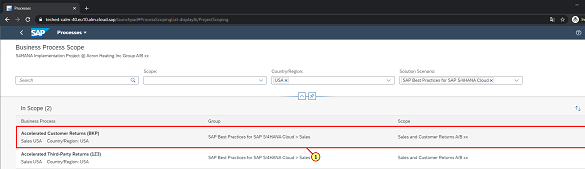

### Step 2: Navigate to see details

\(1\) Click   to open the process.

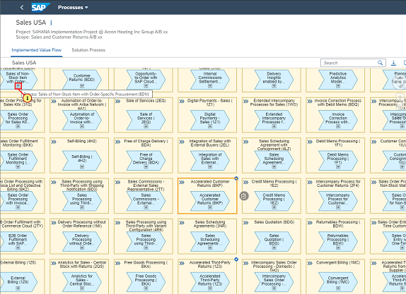

### Step 3: Select a Process Step

\(1\) Click   to select the process step.

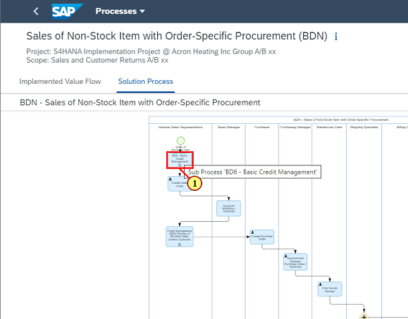

### Step 4: Zoom 

\(1\) Double\-click here   to increase the Zoom level

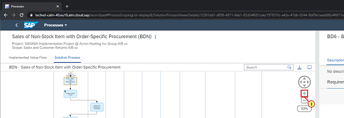

### Step 5: Select a process step

\(1\) Click  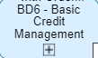.

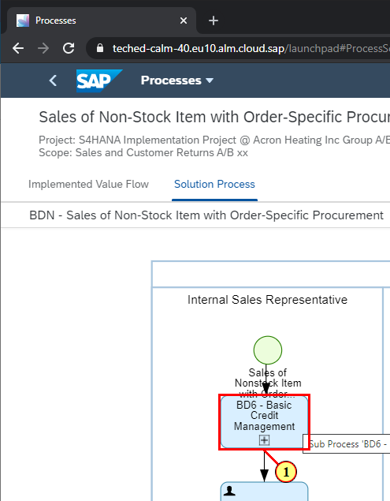

### Step 6: Create Requirement

\(1\) Click  **Create** to create a Requirement for the selected process step.

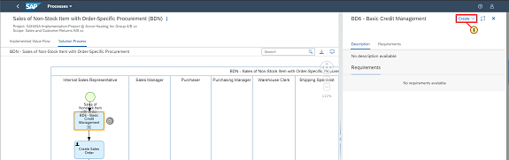

### Step 7: Create Requirement

\(1\) Click  **Create Requirement** .

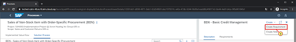

### Step 8: Create Requirement

\(1\) Enter  **Integrate with automatic check report**  in the  **Description Field**  text field.

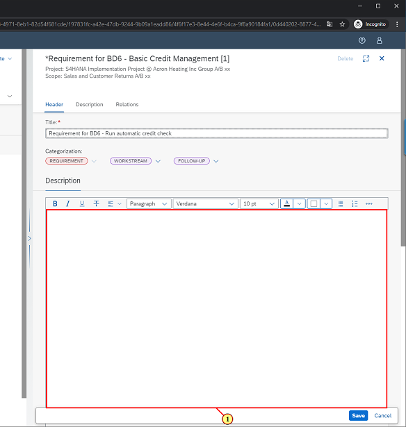

### Step 9: Create Requirement

\(1\) Click   to see the list of Workstreams coming from Activate methodology.

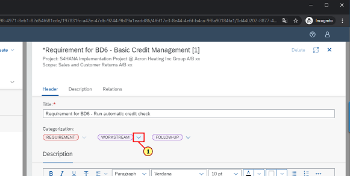

### Step 10: Create Requirement

\(1\) Click  **Integration** .

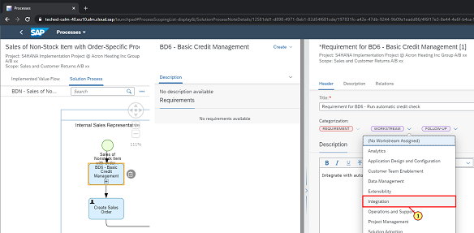

### Step 11: Create Requirement

\(1\) Click  .

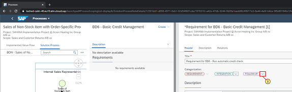

### Step 12: Create Requirement

\(1\) Click  **Task** as you want to follow up on this requirement with a Task.

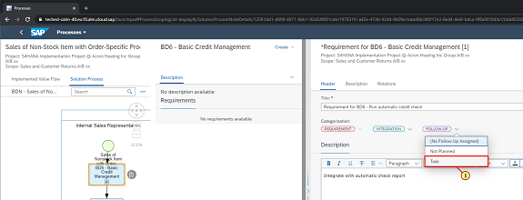

### Step 13: Create Requirement

\(1\) Click  **Save** .

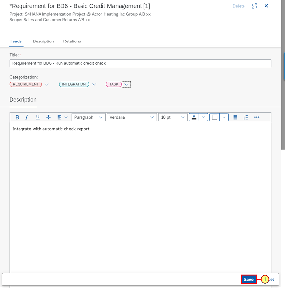

### Step 14: Navigate back

\(1\) Click   logo to return to Fiori launchpad.

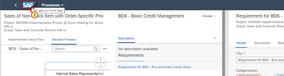

### Step 15: Navigate to Requirement list

\(1\) Click  **Requirements** .

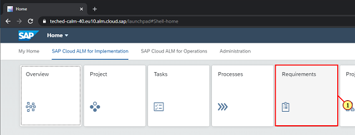

### Step 16: Requirement details

\(1\) Click  to select the Requirement.

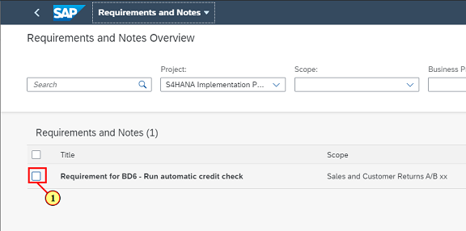

### Step 17: Generate task

\(1\) Click  **Generate Tasks** .

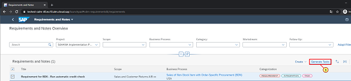

### Step 18: Generate task

\(1\) Click  **Generate** .

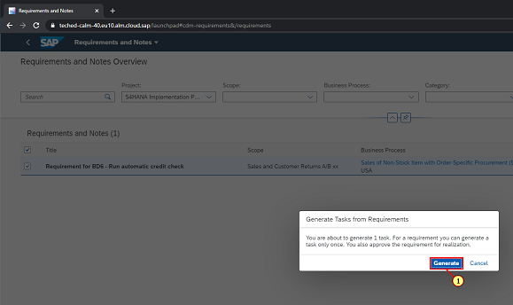

### Step 19: Generate task

\(1\) Note the icon that shows generated task. Click    to select the Requirement and see the details.

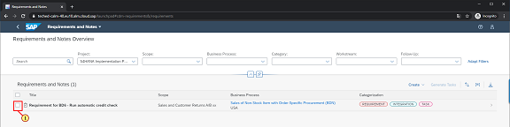

### Step 20: Navigate ahead

\(1\) Click  **Requirement for BD6 \- Run automatic check** to navigate to the generated Task. 

 

You have completed the Chapter.

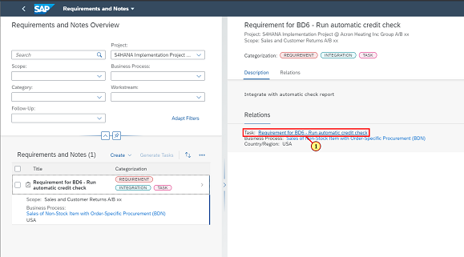

