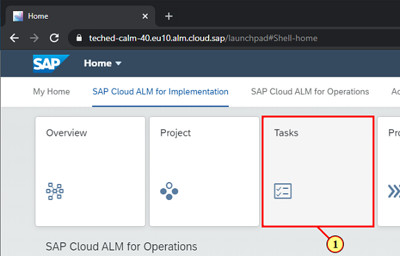
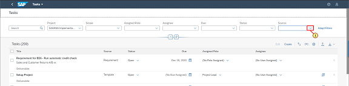
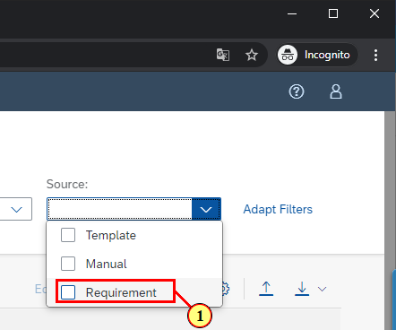
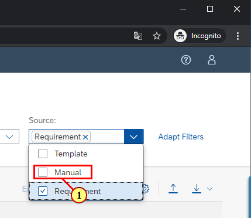
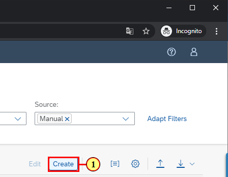
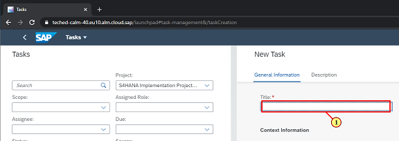
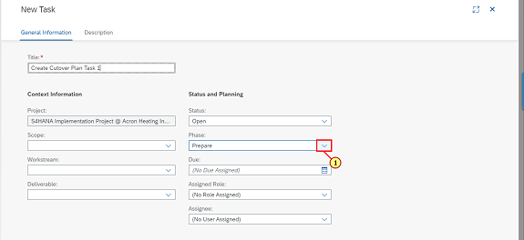
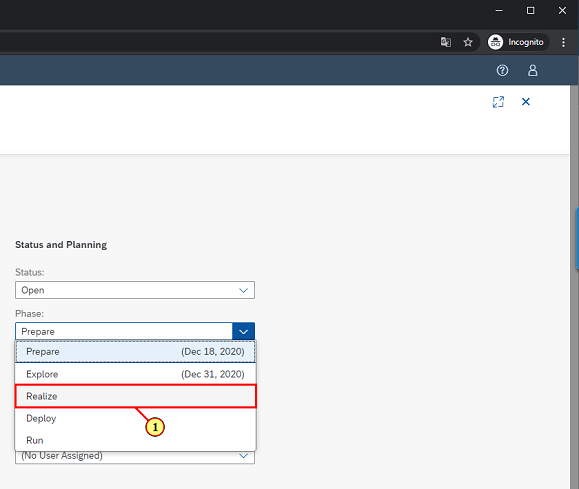
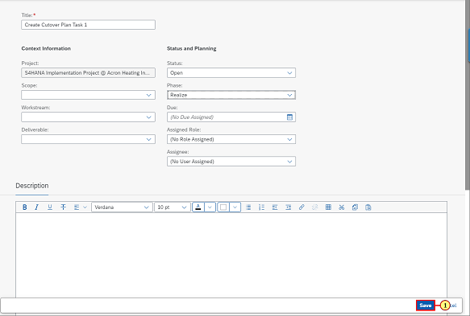
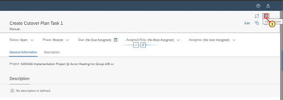

[Back](/README.md)

## Chapter 4 \- Create Manual Task

### Step 1: Navigate to Task list

\(1\) In this chapter , we will learn about Task sources , Click Tasks to get started.

### Step 2: Task sources

\(1\) Click   to see different Task sources.

### Step 3: Task sources

\(1\) Task can come from the Activate template selected during Project creation. Tasks can also be created manually. But first lets try to find the Task you created in the previous chapter via a Requirement. Click   to select the Tasks coming from Requirements.

### Step 4: Task sources

\(1\) Note that the task list is reduced to the task created earlier. Proceed to select Task Source as Manual 

### Step 5: Manual Task

\(1\) Click  **Create**  to create a Task manually.

### Step 6: Enter task details

\(1\) Enter  **Create Cutover Plan Task 1**  in the  **Title**  text field.

### Step 7: Enter task details

\(1\) Click   to select the Phase.

### Step 8: Enter task details

\(1\) Click  **Realize** .

### Step 9: Save

\(1\) Click  **Save** .

### Step 10: Close

\(1\) Click   to close the window. 

 

 You have completed the Chapter.

