## Chapter 5 \- Mass Download and Upload 

### Step 1: Tasks - Google Chrome

\(1\) In this Chapter we will mass upload Tasks. Click   to first download the task created before as a Template.

### Step 2: Tasks - Google Chrome

\(1\) Click  **Download All Manual Tasks as Template** .

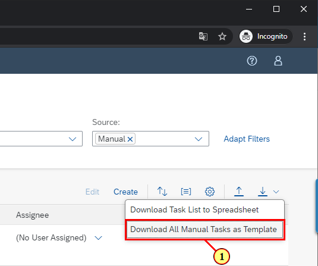

### Step 3: Tasks - Google Chrome

\(1\) Click   to open the downloaded file.

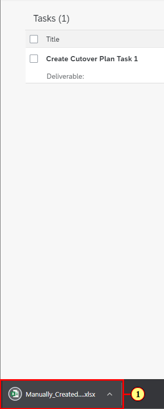

### Step 4: Manually_Created_Tasks (15).xlsx - Excel

\(1\) Drag  **Create Cutover Plan Task 1** .

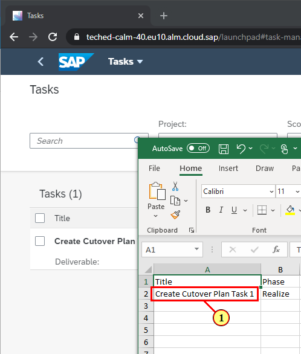

### Step 5: Manually_Created_Tasks (15).xlsx - Excel

\(1\) Drop on  .

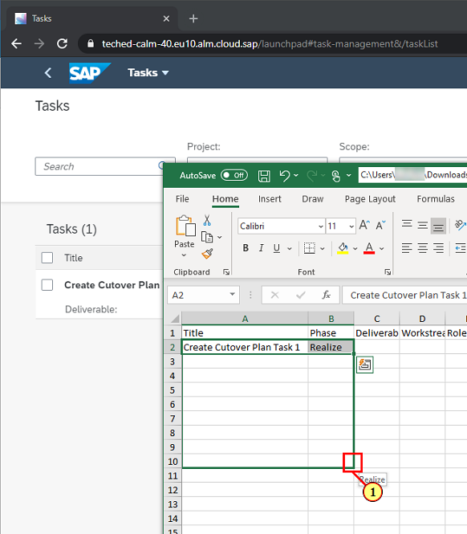

### Step 6: Manually_Created_Tasks (15).xlsx - Excel

\(1\) Delete the first row to avoid duplicate as this task already exists in system.

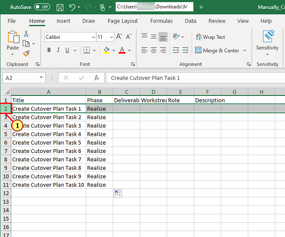

### Step 7: Manually_Created_Tasks (15).xlsx - Excel

\(1\) Click  .

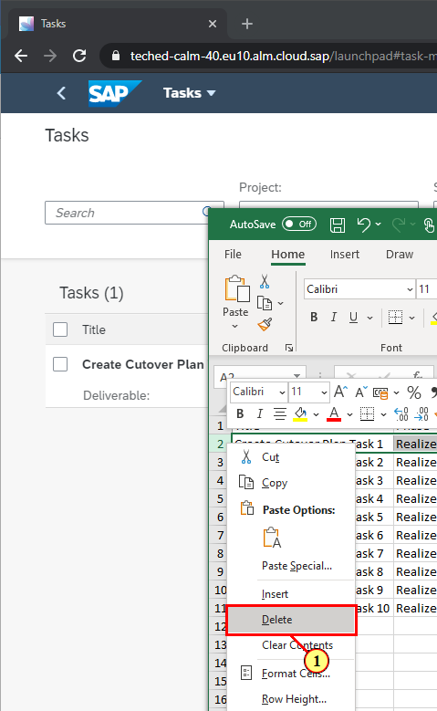

### Step 8: Manually_Created_Tasks (15).xlsx - Excel

\(1\) Enter  **\_IIS266**  in the  **File Name**  text field.

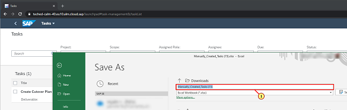

### Step 9: Manually_Created_Tasks (15).xlsx - Excel

\(1\) Click  **Save** .

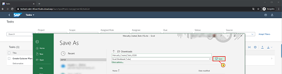

### Step 10: Manually_Created_Tasks_IIS266.xlsx - Saved

\(1\) Click  .

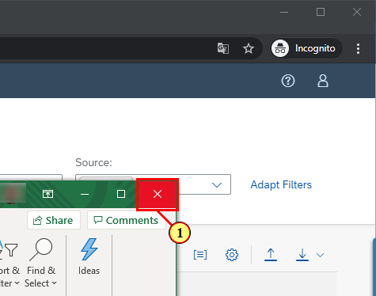

### Step 11: Tasks - Google Chrome

\(1\) Click   to see the upload option.

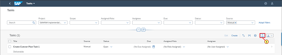

### Step 12: Tasks - Google Chrome

\(1\) Click  **Browse\.\..** to locate the file created earlier.

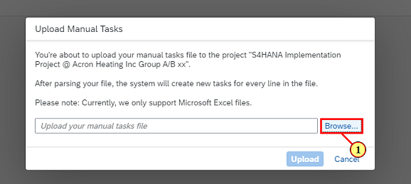

### Step 13: Open

\(1\) Double\-click here  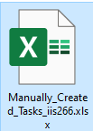.

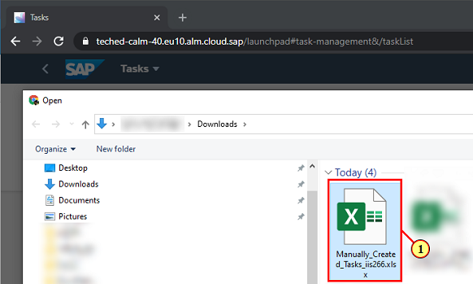

### Step 14: Tasks - Google Chrome

\(1\) Click  **Upload** .

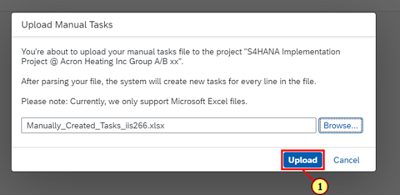

### Step 15: Tasks - Google Chrome

\(1\) Click  .

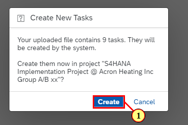

### Step 16: Tasks - Google Chrome

Note the task count of manual tasks has increased.

 

You have completed the Chapter.

 

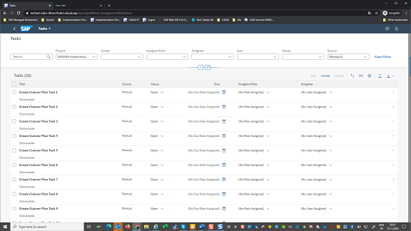

