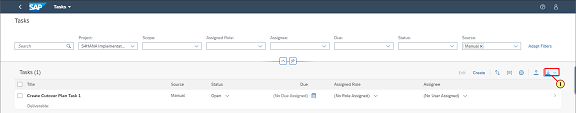

[Back](/README.md)

## Chapter 5 \- Mass Download and Upload 

### Step 1: Download Task as Template

\(1\) In this Chapter we will mass upload Tasks. Click   to first download the task created before as a Template.

### Step 2: Download Task as Template

\(1\) Click  **Download All Manual Tasks as Template** .

### Step 3: Open the downloaded file

\(1\) Click   to open the downloaded file.

### Step 4: Update the downloaded file

\(1\) Drag  **Create Cutover Plan Task 1** .

### Step 5: Update the downloaded file

\(1\) Drop on  .

### Step 6: Delete the task that exists in system

\(1\) Delete the first row to avoid duplicate as this task already exists in system.

### Step 7: Save the file

\(1\) Click  .

### Step 8: Save the file

\(1\) Enter  **\_IIS266**  in the  **File Name**  text field.

### Step 9: Save the file

\(1\) Click  **Save** .

### Step 10: Close the file

\(1\) Click  .

### Step 11: Upload Tasks

\(1\) Click   to see the upload option.

### Step 12: Locate the file

\(1\) Click  **Browse\.\..** to locate the file created earlier.

### Step 13: Open

\(1\) Double\-click here  .

### Step 14: Upload the tasks

\(1\) Click  **Upload** .

### Step 15: Tasks

\(1\) Click  .

### Step 16: Note the new Tasks uploaded

Note the task count of manual tasks has increased.

 

You have completed the Chapter.

 

