[Back](/README.md)

## Chapter 6 \- Task Assignment 

In this Chapter you know how can you assign tasks to yourself

### Step 1: Home - Google Chrome

\(1\) Click  **Overview** .

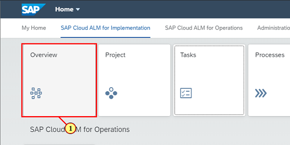

### Step 2: Overview - Google Chrome

\(1\) Note that you have no assigned tasks. Click to navigate to Task list and assign some tasks.

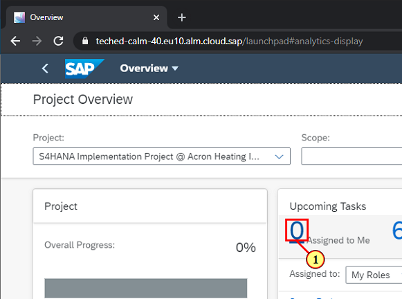

### Step 3: Tasks - Google Chrome

\(1\) Click   to remove the active filter and see all tasks.

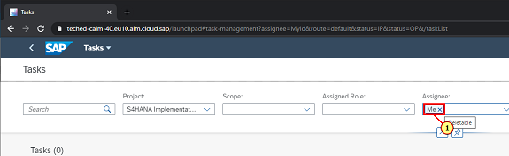

### Step 4: Tasks - Google Chrome

\(1\) Click  .

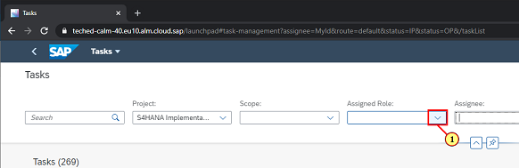

### Step 5: Tasks - Google Chrome

\(1\) Click  .

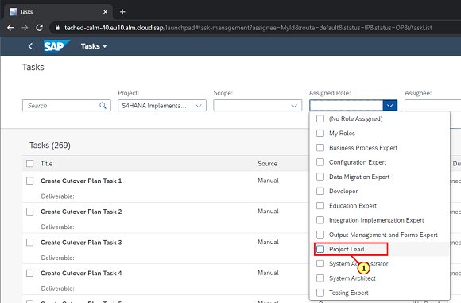

### Step 6: Tasks - Google Chrome

\(1\) Click   to select all tasks.

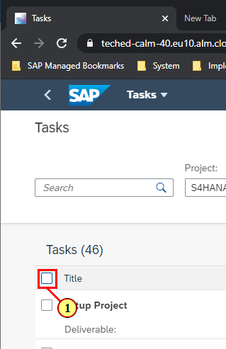

### Step 7: Tasks - Google Chrome

\(1\) Click  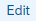 to launch mass editing.

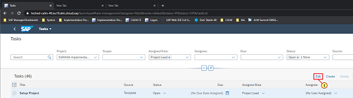

### Step 8: Tasks - Google Chrome

\(1\) Click  .

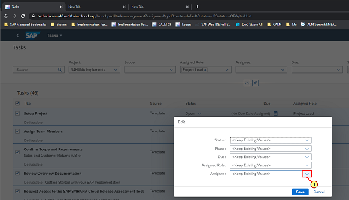

### Step 9: Tasks - Google Chrome

\(1\) Click  .

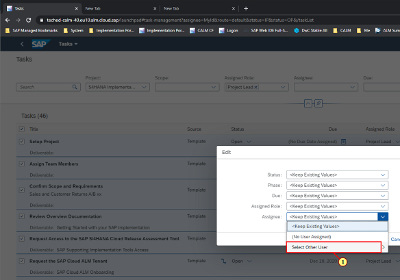

### Step 10: Tasks - Google Chrome

\(1\) Search for your user name by entering teched\-build xx where xx is your user name

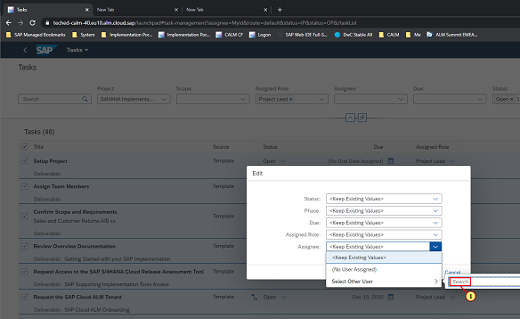

### Step 11: Tasks - Google Chrome

\(1\) Click  .

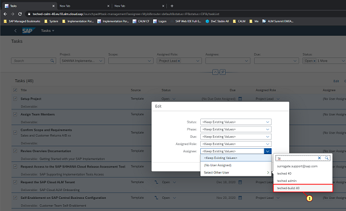

### Step 12: Tasks - Google Chrome

\(1\) Click  .

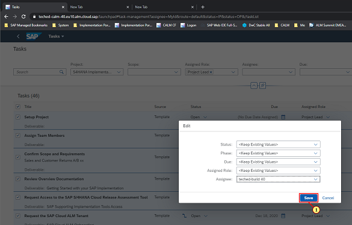

### Step 13: Tasks - Google Chrome

\(1\) Notice that the assignee column shows your user name. Click   to go back to Overview\.\.

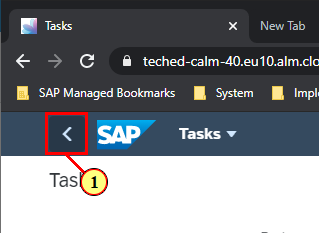

### Step 14: Overview - Google Chrome

Note the number of tasks assigned to you has changed.

 

You have completed this Chapter.

 

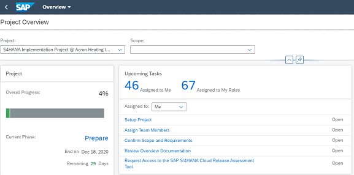

