[Back](/README.md)
 
 ## Chapter 7 \- Mass Edit

### Step 1: Make sure you are in Overview Page

\(1\) Ensure you are in Overview.

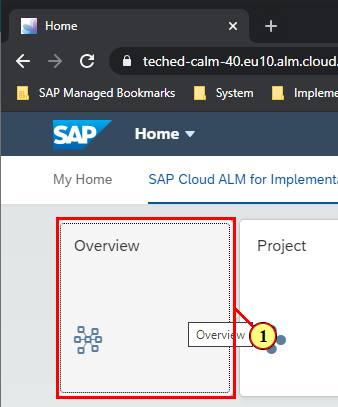

### Step 2:Navigate to Task list from Overview Page

\(1\) Click on the header of tile Tasks Status to navigate to Task list.

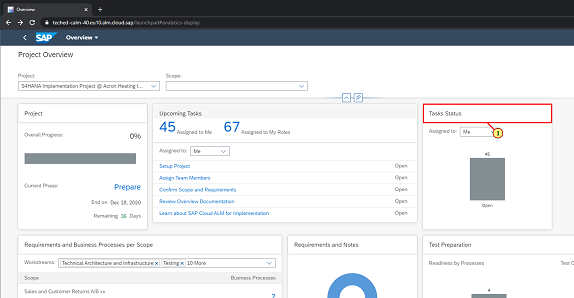

### Step 3: Adapt Filters

\(1\) Note that the attribute Workstream is not added to filters by default.Click  **Adapt Filters**  to add it.

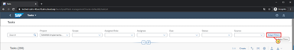

### Step 4: Add Workstream to the filter list

\(1\) Click the  **Checkbox for Workstream** .

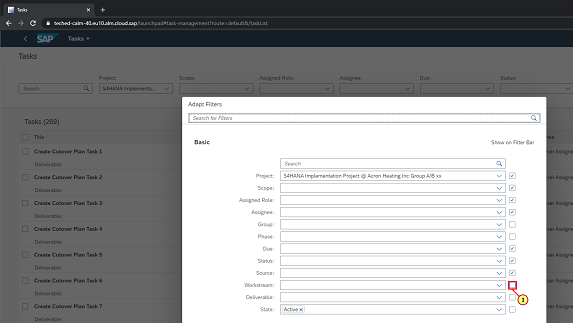

### Step 5: Navigate back

\(1\) Click  **Go** .

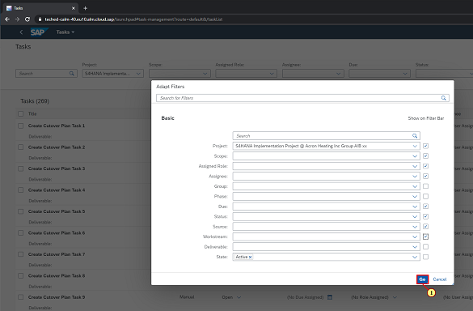

### Step 6: Open Task List results column settings 

\(1\) Click   to add the  **Workstream** Column in the result list.

### Step 7: Ensure Workstream is visible in result list

\(1\) Click the  **Checkbox for Workstream** .

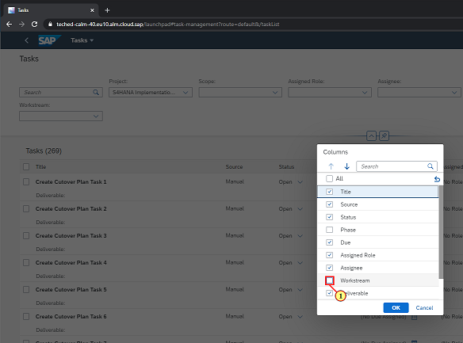

### Step 8: Click ok

\(1\) Make sure  **Workstream** is checked.Click  **OK** .

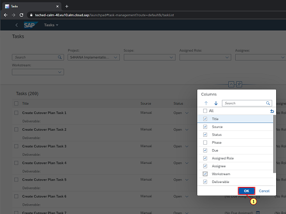

### Step 9: Select a Workstream

\(1\) Click   ** to select a Workstream** .

### Step 10: Select Project Management

\(1\) Click  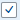.

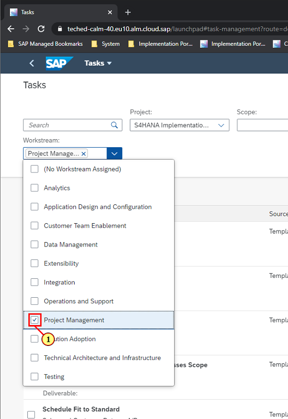

### Step 11: Select all tasks for the Workstream Project Management

\(1\) Click   to select all tasks for selected Workstream.

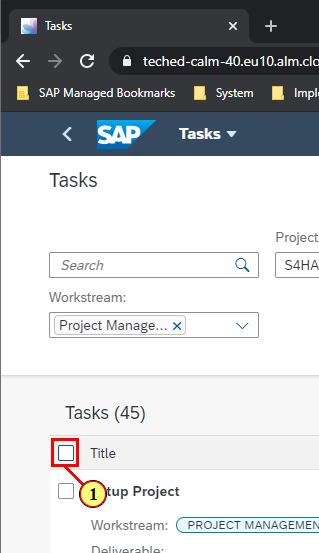

### Step 12: Launch Mass Editing

\(1\) Click  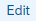 to launch mass editing.

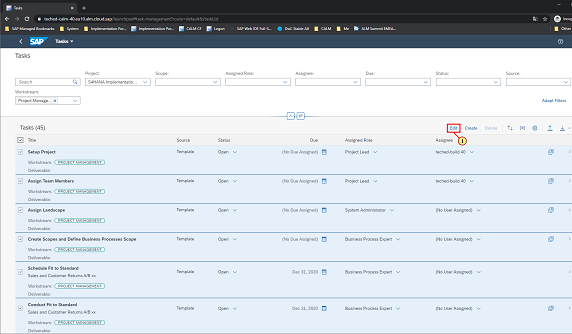

### Step 13: Select a status

\(1\) Click  .

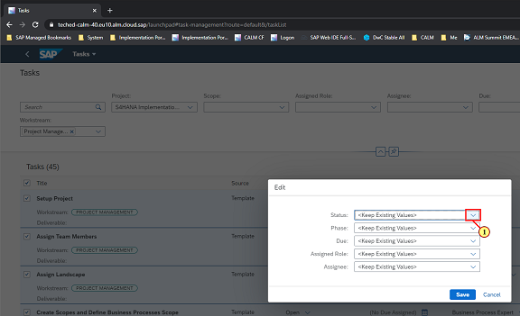

### Step 14: Select Done

\(1\) Click  .

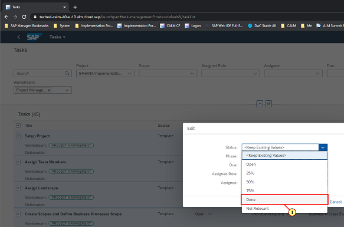

### Step 15: Save

\(1\) Click  .

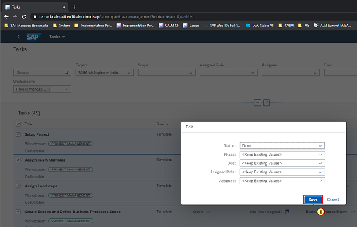

### Step 16: Navigate back to overview

\(1\) Notice that status of all selected tasks has been updated to Done.Click   to go back to Overview.

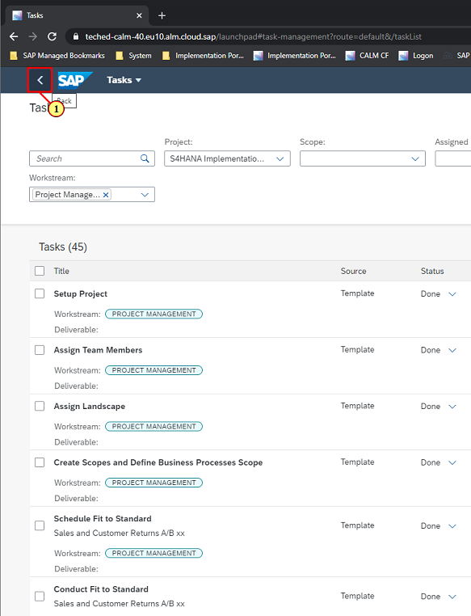

### Step 17: Notice updated Progress, navigate back to Task List

\(1\) Click  **Tasks Status**  to go back to Task List

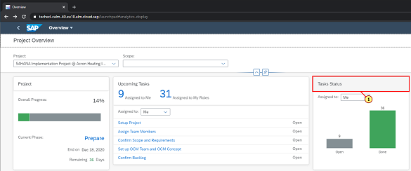

### Step 18: Adapt filters

\(1\) Now we will repeat the steps for Deliverable attribute.Click  **Adapt Filters** .

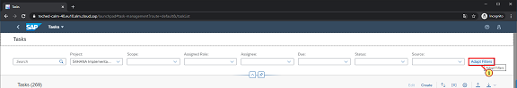

### Step 19: Ensure Deliverable filter is visible

\(1\) Click the  ** Checkbox of Deliverable** .

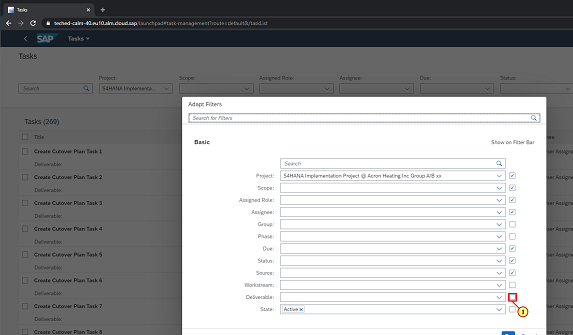

### Step 20: Go

\(1\) Ensure Deliverable attribute is selected.Click  **Go** .

### Step 21: Launch column settings again

\(1\) Click  .

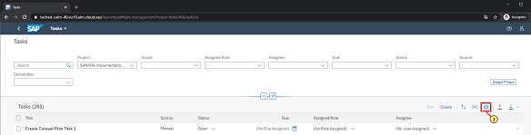

### Step 22: Tasks

\(1\) Click  **OK** .

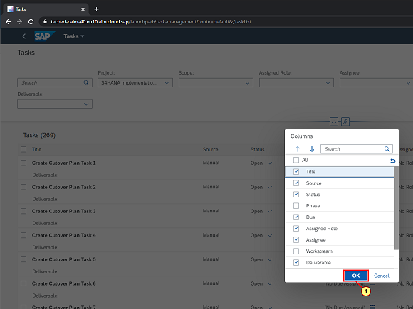

### Step 23: Select a Deliverable

\(1\) Click   ** to select a Deliverable** .

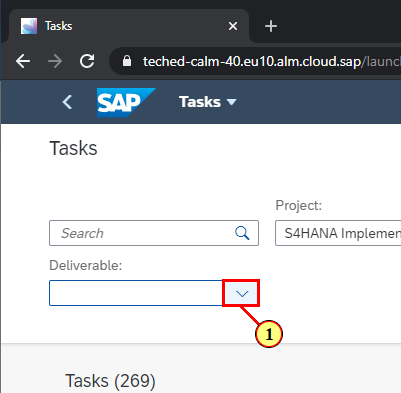

### Select Customer Team Self-Enablement

\(1\) Select  **Customer Team Self Enablement**  .

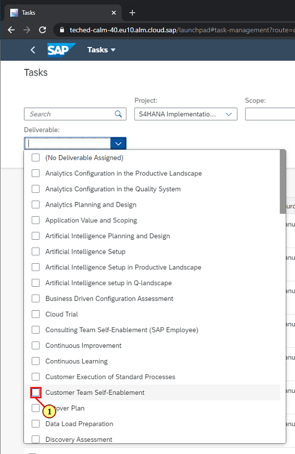

### Step 25: Close the dropdown

\(1\) Click   ** to close the Dropdown List** .

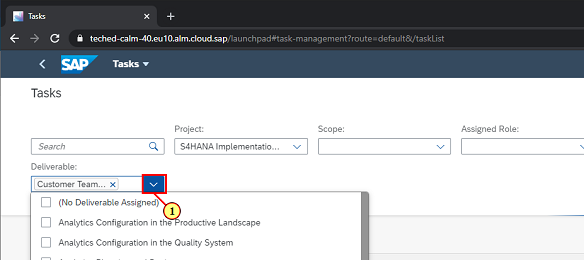

### Step 26: Tasks 

\(1\) Click   to select all tasks for the Deliverable.

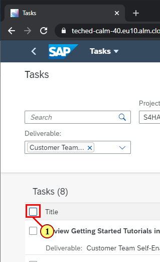

### Step 27: Tasks 

\(1\) Click  **Edit** .

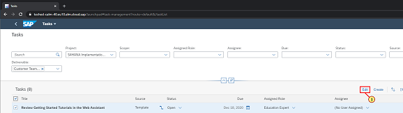

### Step 28: Select a date

\(1\) Click   to select a Due date.

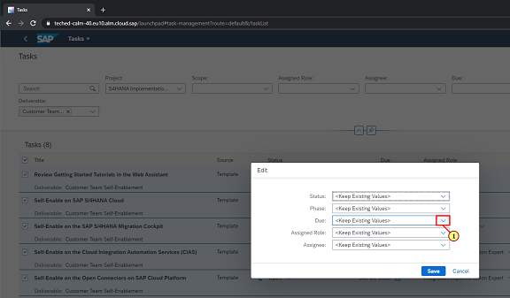

### Step 29: Select a date

\(1\) Click  **Select New Date** .

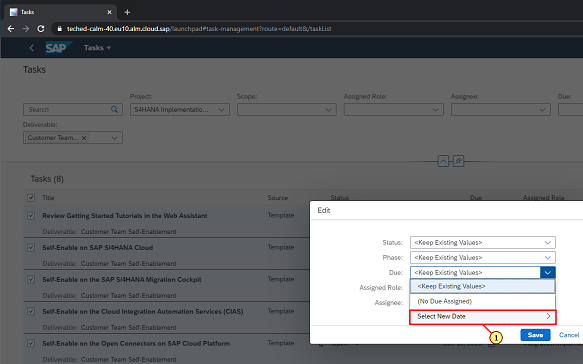

### Step 30: Select a date

\(1\) Select a date.

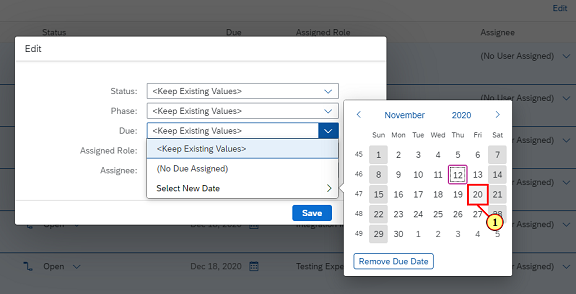

### Step 31: Status

\(1\) Click   ** to select a Status** .

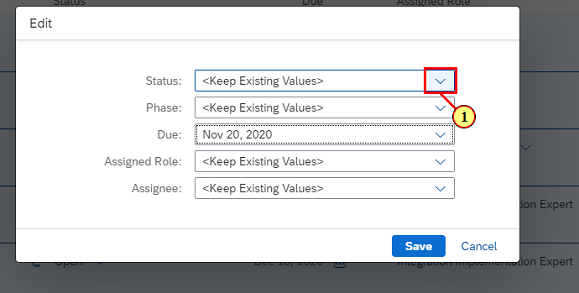

### Step 32: Tasks  

\(1\) Click  .

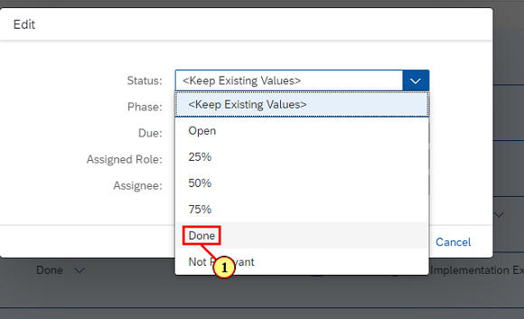

### Step 33: Tasks

\(1\) Click  .

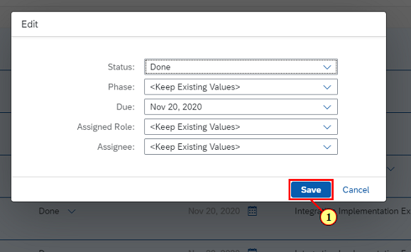

### Step 34: Overview

\(1\) Click   to go back to Overview.

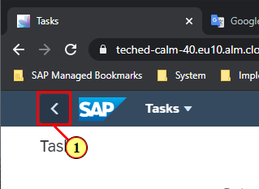

### Step 35: Overview - Google Chrome

Note the change in Overall Progress %age. 

 

You have finished this Chapter.

 

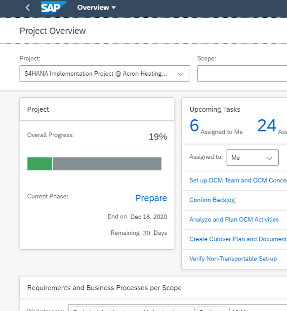

