[Back](/README.md)

## Chapter 8 \- Parallel Projects 

In this Chapter we will explore how SAP Cloud ALM supports multiple parallel projects. You will create a new Project and also switch between Projects

### Step 1: Overview

\(1\) Navigate to Overview.

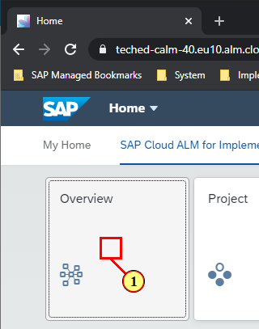

### Step 2: Create Project

\(1\) You can create additional projects and can work on multiple projects in parallel. Click here to create a new Project

 

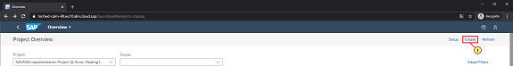

### Step 3: Project details

\(1\) This project will be for Hire to Retire Implementation. Enter  **Hire 2 Retire Project &#64; Acron Heating Inc Group A/B xx**  in the  **Project**  text field.

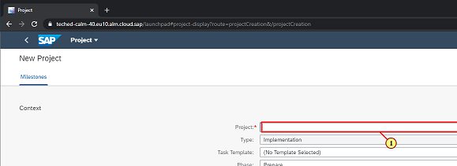

### Step 4: Project details

\(1\) Click   ** to select a Task Template** .

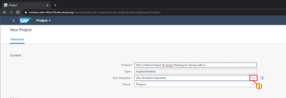

### Step 5: Project details

\(1\) Select Hire to Retire template

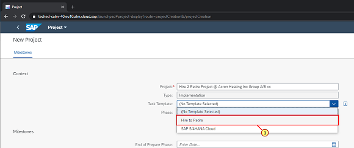

### Step 6: Project details

\(1\) Click  **Save** .

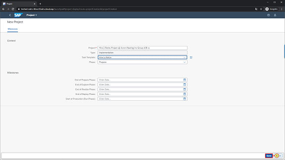

### Step 7: Project details

\(1\) Click   to go back to overview.

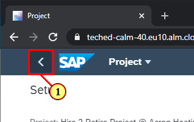

### Step 8: Overview

\(1\) Notice that the overview page now shows data from the newly created Project. You can see the Progress is set to 0%. 

Click    to see list of available Projects in the system

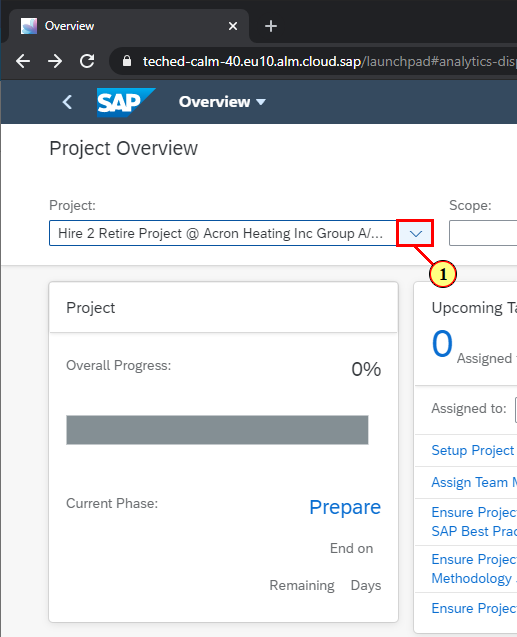

### Step 9: Switch Projects

\(1\) Find the Project you created before and select it. Select  **S4HANA Implementation Project &#64; Acron Heating Inc Group A/B xx**  .

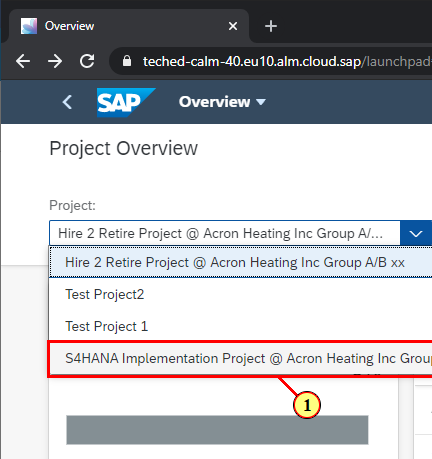

### Step 10: Switch Projects

​Note that after switching the Project, you can see the previous state of the Project you were working on.

 

You have successfully completed the exercise

 

 

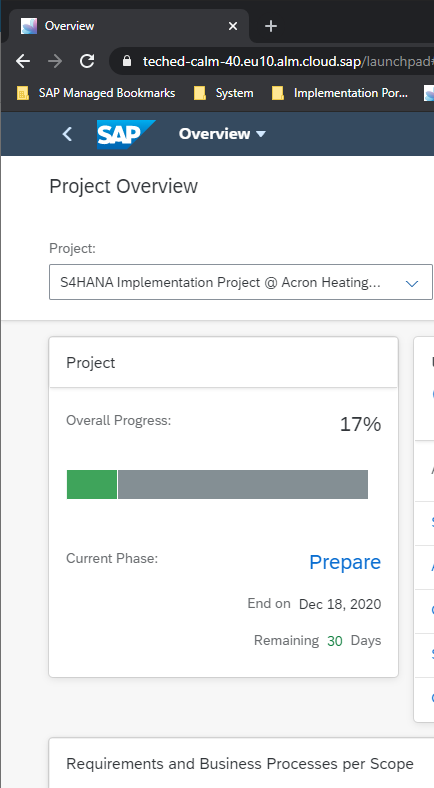

### Step 11: Overview - Google Chrome

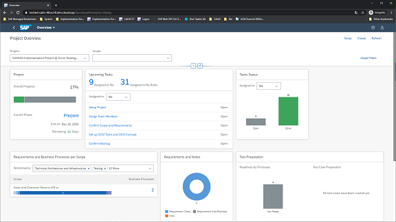

